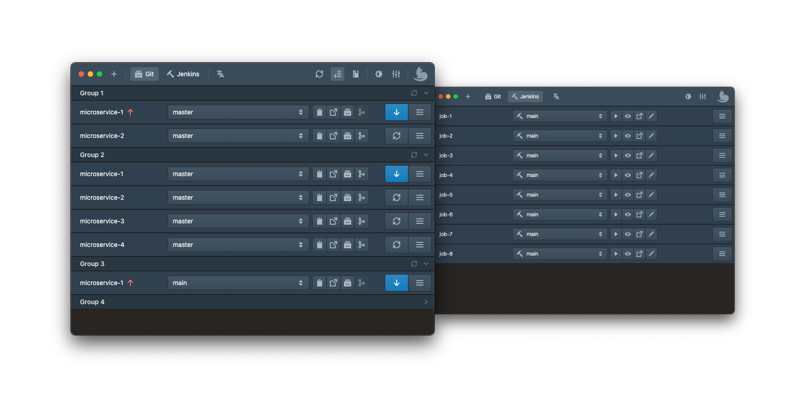

# devkitty 

<https://devkitty.app/>

Swiss army knife for developers.\
Easily manage multiple Git repositories and Jenkins jobs in one screen.

**Git** (GitHub, GitLab, Bitbucket) | **Jenkins** | **Google Translate API**

## Features

- Manage multiple Git projects
- Manage Jenkins Jobs
- Quick checkout between branches with stash or create new branches
- Auto fetch projects
- Create and view pull requests
- Quickly copy branch names
- Easily sync projects with their remote
- Open on GitHub, Bitbucket, GitLab...
- Integration with your favorite IDE or code editor
- Open in iTerm
- Reveal in Finder

## License

Devkitty is [MIT licensed](./LICENSE).
